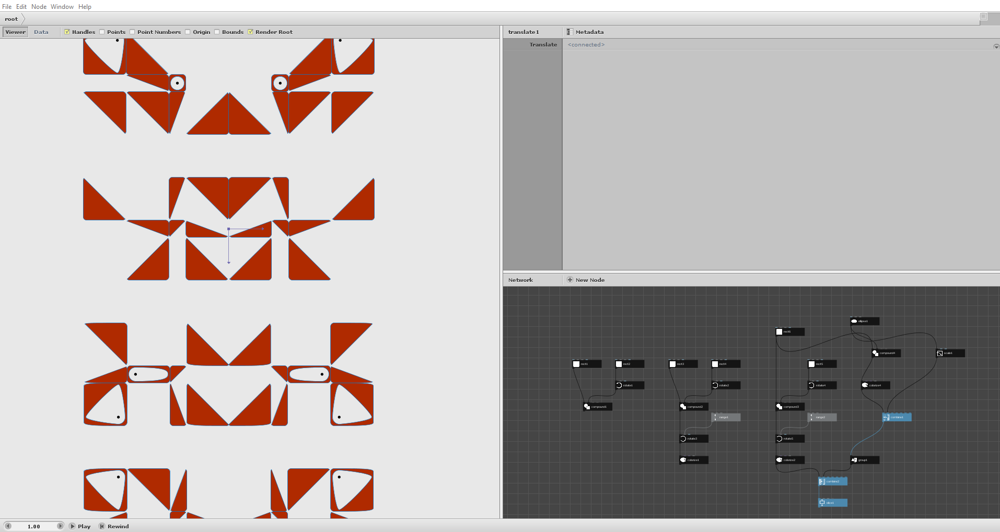

## INFO

I have prepared these three files for my introductory lessons to Nodebox3.

They are derived from the beginner examples published on the official website which can be found here: [01 Sample](https://www.nodebox.net/node/documentation/tutorial/getting-started), [02 Sample](https://www.nodebox.net/node/documentation/tutorial/animation), [03 Sample](https://www.nodebox.net/node/documentation/using/generative-design).

The files contain all the work steps and some comments in Italian.

