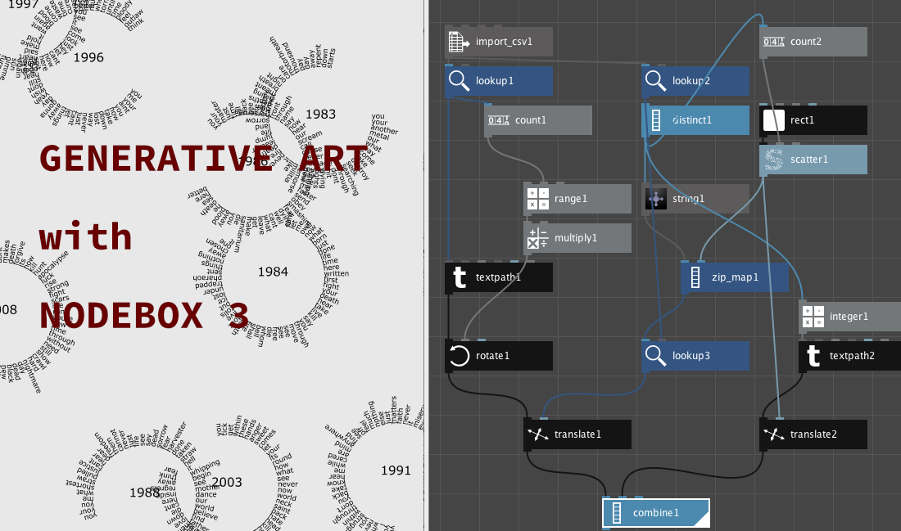

# Generative Art with Nodebox 3

Nodebox 3 seems an abandoned project and it's a shame 'cause it was a really good tool to get closer to generative art and design.

The [official website](https://www.nodebox.net/node/) is still active and I use this software to introduce students to node programming.

This repository contains the best materials still around, in compressed backup form. Backups always report the credits of the authors and their sites.

Most come from GitHub repositories that have not been updated for several years.

## Credits

- [Code & Type](http://code-type.com/)
- [Formas](https://github.com/guilhermesv/Formas)
- [Introducao ao Design Computacional com NodeBox 3](https://github.com/guilhermesv/Introducao-Ao-Design-Computacional-SESC-Campinas)
- [Nodebox](https://github.com/nodebox/nodebox)
- [Nodebox Code Sketches](https://github.com/eesur/template-nodebox-sketches)
- [Nodebox Daily Sketches](https://github.com/eesur/nodebox-daily-sketches)
- [Nodebox Examples](https://github.com/bitcraftlab/nodebox-examples)
- [Nodebox MIDI Importer](https://github.com/fdb/midimport)
- [Nodebox Proportional Area Chart](https://github.com/eesur/nodebox-proportional-area-chart)
- [Nodebox SVG Colorizer](https://github.com/chema-mengibar/nodebox3-svg-colorizer)

